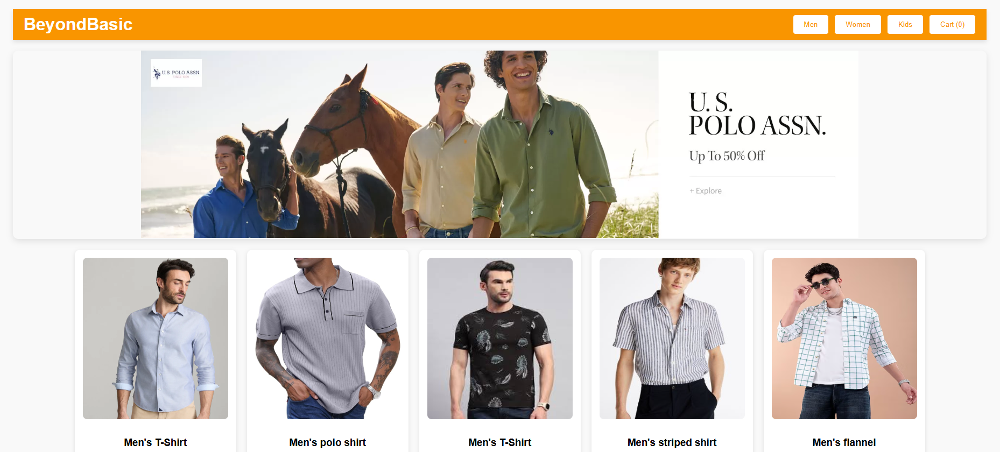
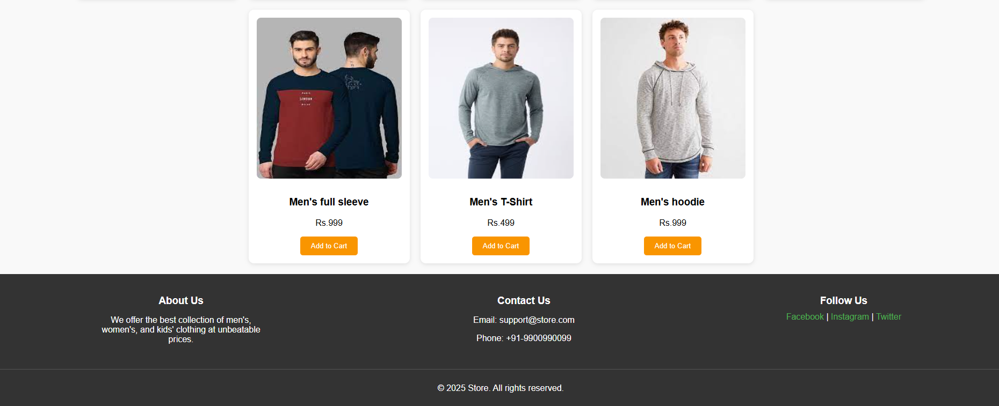
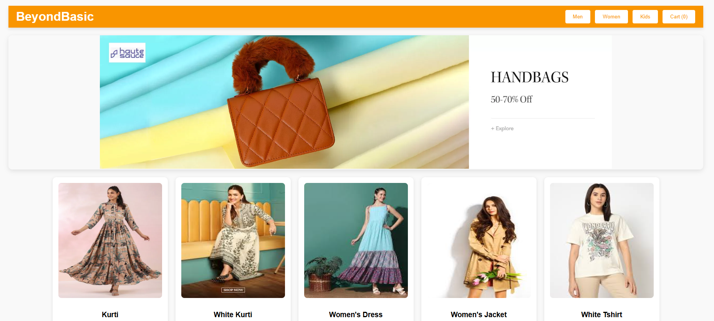

# BeyondBasic - Mini E-Commerce Store

A simple responsive clothing store front-end project created as a mini project for Web Programming class at VIT.

## 🛍️ Features

- Category tabs (Men / Women / Kids)
- Dynamic product loading
- Interactive cart with quantity + / -
- Category-wise banner change
- Responsive layout and styling

## 🚀 How to Run

1. Clone/download the repository.
2. Open `index.html` in any browser.
3. That’s it — explore the mini store!

> **Note:** Product images have been removed. Only screenshots are shown below.

---

## 📸 Preview

### 🖼 Homepage

### 🛒 Cart Page

### 👕 Product Section

---

## 🛠 Tech Stack

- HTML
- CSS
- JavaScript

---

Made with ❤️ by Aadya Kapoor
